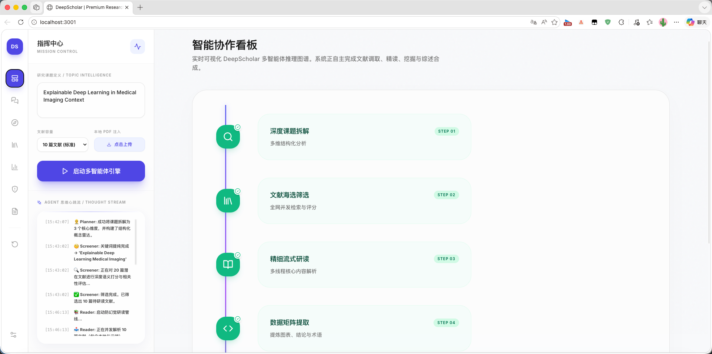
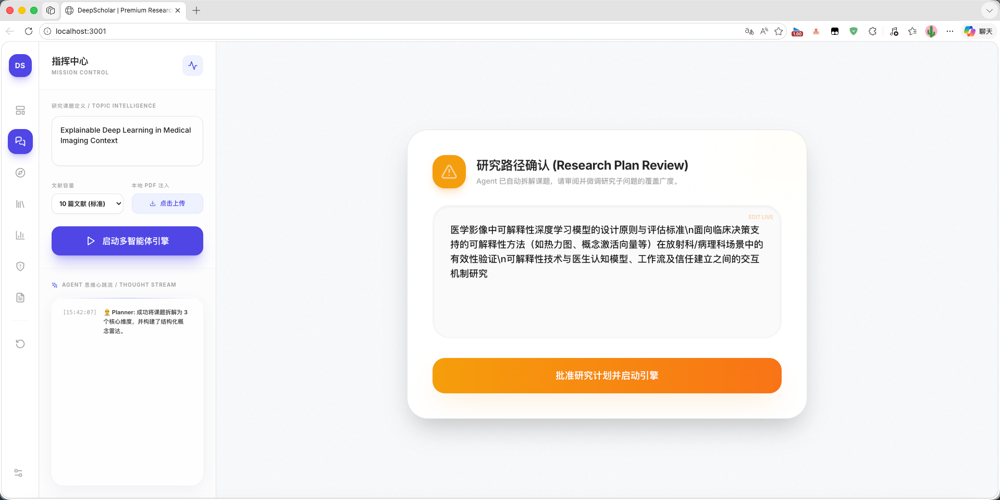
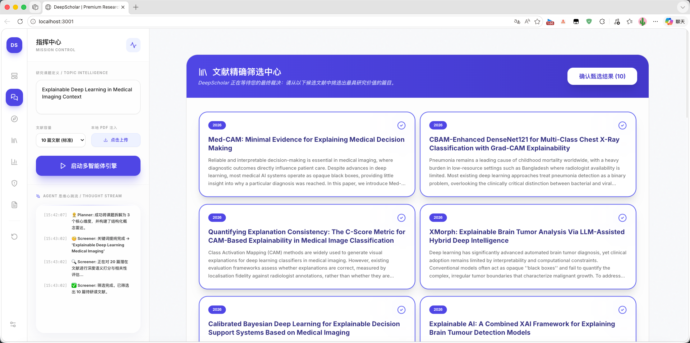
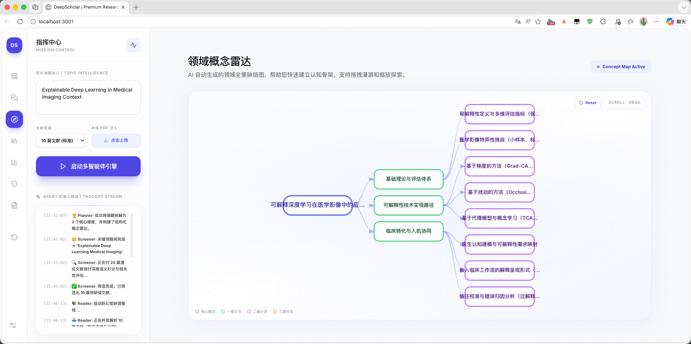
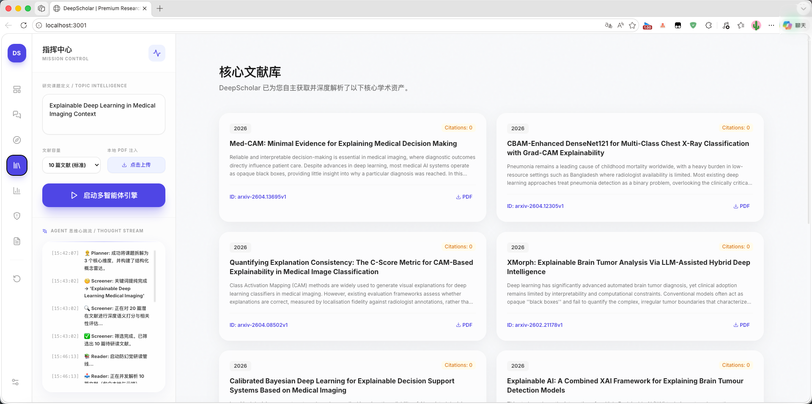
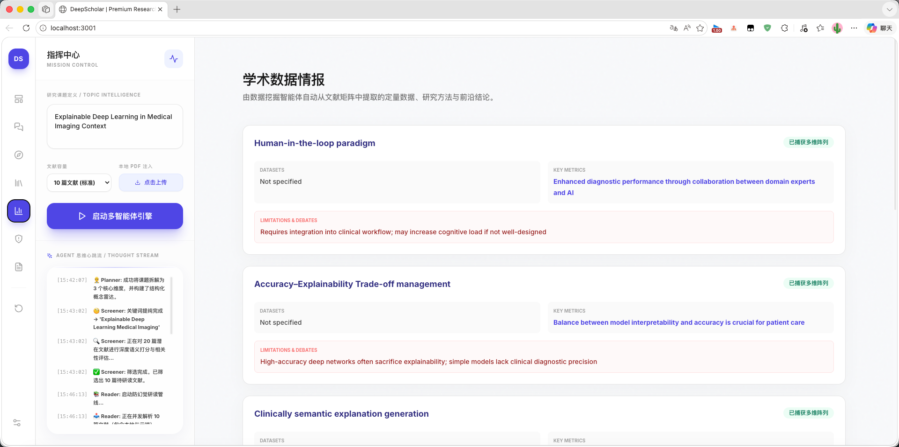
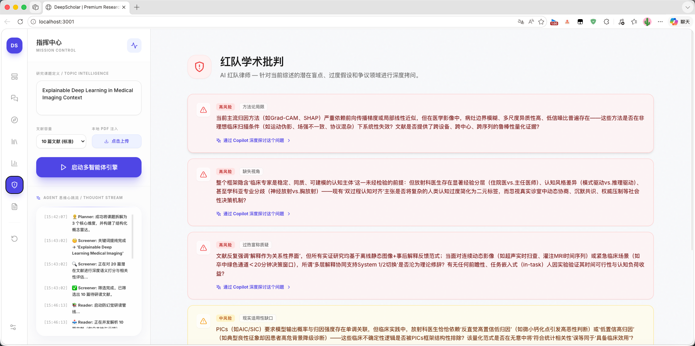
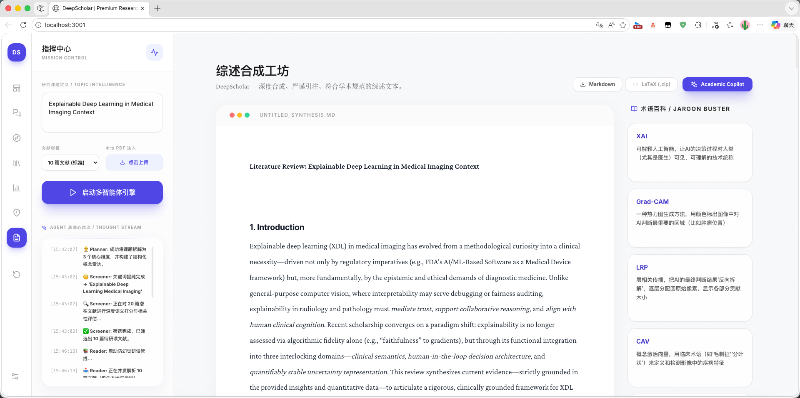
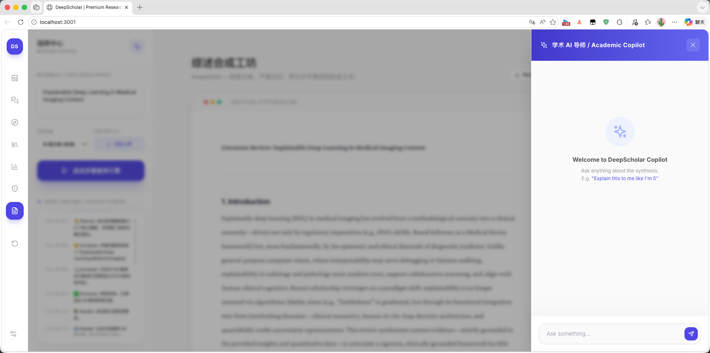

# DeepScholar


DeepScholar 是一个基于大语言模型（LLM）的多智能体学术研究工作站。系统利用 LangGraph 进行复杂流程编排，旨在实现学术文献调研、筛选、精读与综述合成的端到端自动化。通过引入人机协同（Human-in-the-Loop）机制与持久化架构，系统能够在保证研究深度的同时，提供高度的可控性与透明度。

---

## 核心设计理念

### 1. 结构化智能体协同 (Multi-Agent Orchestration)
系统将复杂的科研任务拆解为多个专业化节点，通过状态机进行循环调度：
- **Planner**: 制定多维度的研究路径与子课题。
- **Screener**: 自动化检索学术数据库，并根据相关性进行初步筛选。
- **Reader**: 深度解析文献全文，提取核心论点与实验数据。
- **DataMiner**: 跨文献挖掘核心见解，构建知识关联。
- **Writer & Reviewer**: 迭代式协同写作，通过“写-审-改”循环提升产出质量。
- **Critic & Editor**: 提供批判性视角，并根据用户反馈进行针对性修订。

### 2. 人机协同与可控性 (Human-in-the-Loop)
DeepScholar 拒绝“黑盒式”生成。在关键节点设有逻辑断点：
- **路径校准**: 在大规模研究启动前，用户需审核并修正 Agent 生成的研究计划。
- **文献优选**: 在初筛阶段，用户可以手动干预文献列表，确保后续分析的精准度。

### 3. 可观测性与持久化 (Observability & Persistence)
- **实时思维流**: 基于 Server-Sent Events (SSE) 协议，前端可实时观测智能体的推理逻辑、检索动作与分析权衡。
- **会话持久化**: 基于 SQLite 的 Checkpointer 机制，支持研究任务的断点续传。所有搜索记录、阅读笔记与中间产物均实时同步至本地数据库。

### 4. 本地化资源整合 (Document Integration)
- **BYO-PDF**: 支持用户上传本地 PDF 文献。系统利用 PyMuPDF 进行高精度解析，并将其作为高优先级知识源并入当前的语料库。
- **研究助手 (Copilot)**: 基于已生成的综述内容与提取的见解，提供上下文相关的学术问答支持。

---

## 技术堆栈

- **后端**: FastAPI (Python) + LangGraph (状态机编排) + LangChain (智能体交互)
- **持久化**: SQLite3 + langgraph-checkpoint-sqlite
- **前端**: React 18 + Vite + TailwindCSS + Framer Motion (动效交互)
- **解析引擎**: PyMuPDF (fitz) + React Markdown (GFM 支持)
- **通信协议**: SSE (异步事件流传输)

---

## 快速启动

### 1. 环境准备
```bash
conda create -n deep_scholar python=3.10
conda activate deep_scholar
pip install -r requirements.txt
```

### 2. 配置环境变量
在项目根目录创建 `.env` 文件，配置您的 LLM API Key (支持 OpenRouter, DashScope 等兼容 OpenAI 格式的服务)。

### 3. 运行项目
**后端 API:**
```bash
python api.py
```

**前端界面:**
```bash
cd frontend
npm install
npm run dev
```

---

## 项目展示


*智能协作看板：实时可视化 DeepScholar 多智能体推理图谱，系统自动化完成文献调研与综述合成全流程。*


*研究路径确认 (Research Plan Review)：在正式研究开始前，对 Agent 拆解的课题维度进行人工审核与校准。*


*文献精细筛选中心：通过可视化卡片确认 Agent 检索到的文献，支持手动剔除无关条目以确保精度。*


*领域概念雷达：AI 自动生成领域全景脉络图，帮助用户快速建立认知骨架并揭示概念关联。*


*核心文献库：集中展示系统深度解析后的学术资产，支持文献元数据预览与全文追溯。*


*学术数据情报：多维矩阵式数据挖掘，自动提取研究方法、关键指标与前沿结论。*


*红队学术批判：AI 红队律师针对当前综述的潜在盲点、过度假设与争议领域进行深度拷问。*


*综述合成工坊：产出符合学术规范、具备严谨引注的综述文本，并辅以术语百科辅助理解。*


*学术 AI 导师 (Academic Copilot)：交互式对话辅助，针对生成的综述内容提供即时答疑与知识拓展。*

---

> **DeepScholar** —— 致力于通过多智能体协作提升学术研究的效率与深度。
